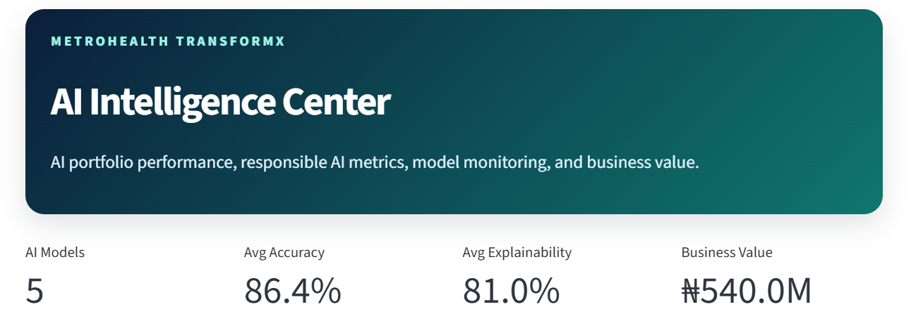
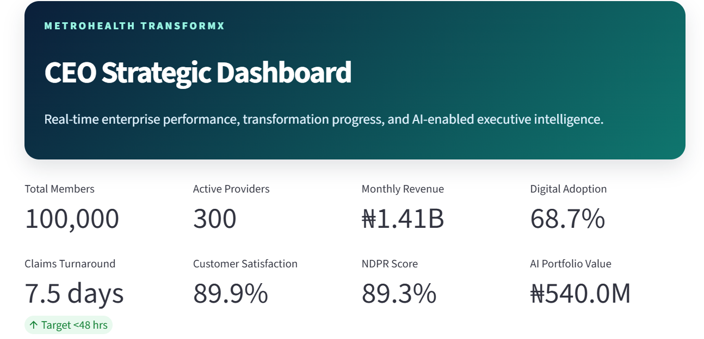
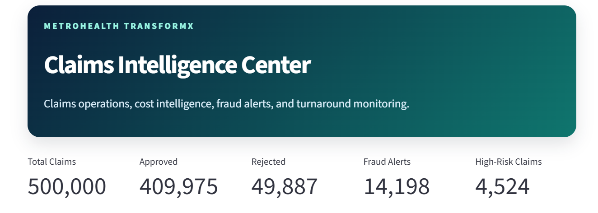
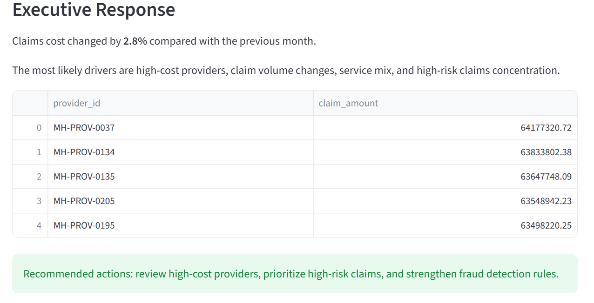
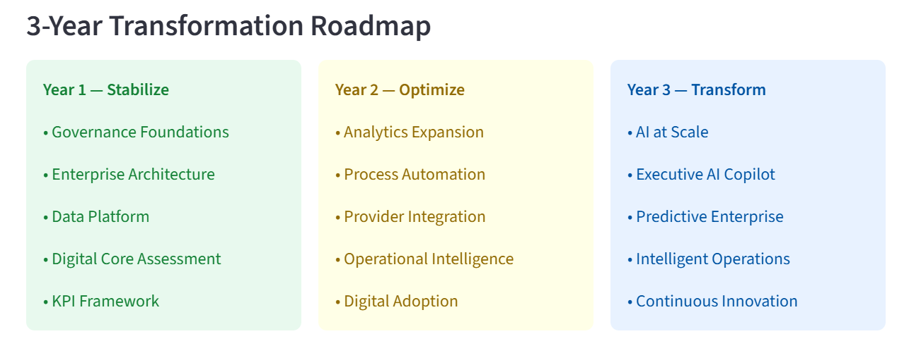

# MetroHealth TransformX

## Enterprise Digital Health Transformation Strategy, Executive Intelligence & AI Command Center

---

# Executive Overview

MetroHealth TransformX is a consulting-grade Digital Health Transformation and Executive Intelligence platform designed to demonstrate how a newly appointed CIO can develop and execute a 3-year enterprise technology strategy, operating model, enterprise architecture, analytics ecosystem, and AI-enabled transformation roadmap.

The platform integrates executive dashboards, enterprise architecture, governance frameworks, operational analytics, financial intelligence, compliance monitoring, responsible AI, and executive decision support into a unified healthcare transformation ecosystem.

---

# Business Challenge

Healthcare organizations continue to face significant challenges including:

- Long claims processing cycles
- Rising healthcare costs
- Fraud and claims leakage
- Provider network inefficiencies
- Customer retention risks
- Compliance and cybersecurity concerns
- Fragmented data environments
- Difficulty realizing value from AI investments

MetroHealth TransformX demonstrates how enterprise architecture, analytics, governance, and AI can be strategically aligned to address these challenges and support sustainable digital transformation.

---

# Strategic Objectives

The platform was designed to:

- Develop a 3-Year CIO Transformation Strategy
- Establish an Enterprise Operating Model
- Improve Executive Decision-Making
- Strengthen Governance & Compliance
- Modernize Digital Core Systems
- Scale Responsible AI Adoption
- Improve Claims Operations
- Enhance Provider Performance
- Improve Customer Experience
- Deliver Measurable Business Value

---

# Executive Intelligence Modules

### CEO Strategic Dashboard

Provides executive visibility into:

- Revenue Performance
- Digital Adoption
- Customer Satisfaction
- Claims Turnaround
- Compliance Metrics
- AI Portfolio Value
- Transformation Progress

### Claims Intelligence Center

Provides visibility into:

- Claims Volume
- Claims Cost Trends
- Fraud Monitoring
- High-Risk Claims
- Provider Cost Drivers
- Operational Performance

### Provider Intelligence Center

Provides insights into:

- Provider Performance
- Reimbursement Analytics
- Geographic Coverage
- Provider Network Optimization
- Utilization Monitoring

### Customer Experience Center

Provides intelligence on:

- Satisfaction Trends
- Member Retention
- Churn Risk
- Complaint Analytics
- Digital Engagement

### Financial Intelligence Center

Provides visibility into:

- Revenue
- Claims Cost
- Operating Cost
- Profitability
- Financial Forecasting

### Compliance & Risk Center

Monitors:

- NDPR Compliance
- NHIA Compliance
- Audit Readiness
- Security Events
- Enterprise Risk Indicators

### AI Intelligence Center

Tracks:

- AI Portfolio Performance
- Model Accuracy
- Explainability Metrics
- Responsible AI Indicators
- Business Value Realization

### Executive AI Copilot

Provides AI-assisted executive decision support by:

- Explaining business performance changes
- Identifying operational drivers
- Highlighting strategic risks
- Recommending executive actions

---

# Enterprise Architecture Blueprint

The target-state enterprise architecture consists of:

### Executive Intelligence Layer

- Executive Dashboards
- Executive AI Copilot
- Strategic KPI Monitoring

### AI & Intelligent Automation Layer

- Fraud Detection
- Claims Risk Scoring
- Churn Prediction
- Provider Intelligence
- Population Health Analytics

### Analytics & Intelligence Layer

- Operational Analytics
- Financial Analytics
- Customer Analytics
- Provider Analytics
- Compliance Analytics

### Enterprise Data Platform Layer

- Data Lake
- Data Warehouse
- Master Data Management
- Metadata Repository
- Data Quality Framework

### Integration & Interoperability Layer

- APIs
- FHIR
- HL7
- ICD-10
- LOINC
- Provider Integrations

### Digital Core Systems Layer

- Claims Management
- Member Management
- Provider Management
- CRM
- Billing
- Compliance

---

# 3-Year CIO Transformation Roadmap

## Year 1 — Stabilize

- Governance Foundations
- Enterprise Architecture
- Data Platform Modernization
- Digital Core Assessment
- KPI Framework

## Year 2 — Optimize

- Analytics Expansion
- Process Automation
- Provider Integration
- Operational Intelligence
- Digital Adoption Programs

## Year 3 — Transform

- AI at Scale
- Executive AI Copilot
- Predictive Enterprise
- Intelligent Operations
- Continuous Innovation

---

# Executive Insights

## Enterprise Performance

- Revenue growth remains strong at ₦1.41B.
- Customer satisfaction (89.9%) and retention (89.8%) remain high.
- AI initiatives currently generate approximately ₦540M in business value.
- Claims turnaround remains the largest operational challenge at 7.5 days.

## Claims Operations

- 500,000 claims processed.
- 14,198 fraud alerts identified.
- 4,524 high-risk claims require active monitoring.
- Fraud prevention remains a major value opportunity.

## Provider Performance

- 300 active providers.
- Average provider performance of 76.4%.
- Geographic concentration risk exists within the provider network.

## Customer Experience

- Strong satisfaction and retention performance.
- 7,167 members identified as elevated churn risk.

## Compliance & Risk

- NDPR compliance score of 89.3%.
- NHIA compliance score of 91.2%.
- Security monitoring remains a strategic priority.

## AI Portfolio

- Five AI models operational.
- Average model accuracy of 86.4%.
- AI portfolio currently delivers ₦540M in estimated business value.

---

# Strategic Recommendations

## Claims Transformation

- Implement AI-assisted claims adjudication.
- Automate claims workflows.
- Reduce claims turnaround below 48 hours.

## Digital Adoption

- Expand member and provider self-service capabilities.
- Increase digital adoption beyond 85%.

## Provider Optimization

- Deploy provider scorecards and benchmarking.
- Reduce geographic concentration risk.

## Financial Optimization

- Reduce claims leakage.
- Improve utilization management.
- Optimize reimbursement controls.

## Cybersecurity & Governance

- Strengthen enterprise security monitoring.
- Advance toward Zero Trust Architecture.
- Expand Responsible AI governance.

## Enterprise AI Scaling

- Expand AI across claims, customer, provider, and executive operations.
- Increase AI portfolio value beyond ₦1B within three years.

---

## Application Screenshots

---

# Technology Stack

- Python
- Streamlit
- Pandas
- NumPy
- Plotly

---

# Project Structure

metrohealth_transformx/

├── app.py

├── requirements.txt

├── README.md

├── screenshots/

└── data/

    ├── claims.csv
    
    ├── providers.csv
    
    ├── customer_experience.csv
    
    ├── finance.csv
    
    ├── compliance_risk.csv
    
    ├── ai_models.csv
    
    └── transformation_roadmap.csv

---

# Expected Strategic Outcomes

- Claims turnaround below 48 hours
- Digital adoption above 85%
- Retention above 93%
- Compliance maturity above 95%
- Reduced claims leakage
- Stronger cybersecurity posture
- AI portfolio value exceeding ₦1B
- Sustainable digital health transformation

---

# Future Enhancements

- Executive GenAI Copilot
- Predictive Financial Forecasting
- Enterprise Data Governance Dashboard
- Population Health Analytics
- Provider Network Optimization Engine
- AI Governance Command Center
- Real-Time Executive Cockpit

---

## Author

### Dr. Samuel Israel

Digital Health Transformation | Healthcare AI | Enterprise Analytics | Responsible AI | Executive Intelligence